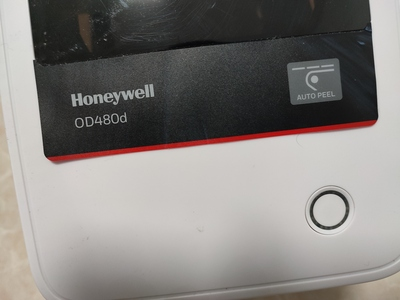

# TSPL 指令打印机驱动

针对TSPL指令集标签打印机开发的驱动程序。   
tspl指令文档参见：[http://lilin-nas.quickconnect.cn/sharing/IlAq1Gge7](http://lilin-nas.quickconnect.cn/sharing/IlAq1Gge7)

[打印票据video](https://www.bilibili.com/video/BV1Nf4y1f7rg/?vd_source=a8ac49f5b8494f07c5d15be8189fe3dd)   
[打印标签video](https://www.bilibili.com/video/BV1WL4y1A7BS/?vd_source=a8ac49f5b8494f07c5d15be8189fe3dd)

---

## 🔨 API 
文档待完善，使用见examples代码（暂以nodejs平台做示例）。    
（2022-07-07 23:27）最近更新了bitmap缩放算法，暂时不做通用封装。  

## ⚠️ 避坑

* 霍尼韦尔OD480打印机，GBK字体文件需要自行写入，且打印GBK时阻塞指令，反应极其缓慢，偶尔会死机。   
  像是小厂的公模产品贴牌，不要被这个品牌知名度所迷惑；官网相关资料很难找。      
  *推荐佳博，TSC等打印机。*    

    

